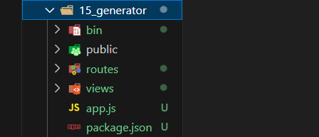

# express 使用

## express下载

express 本身是一个 npm 包，所以可以通过 npm 安装

```
npm init
npm i express
```

## express 初体验

1. 创建 JS 文件，键入如下代码

```javascript
//1. 导入 express
const express = require('express');

//2. 创建应用对象
const app = express();

//3. 创建路由规则
app.get('/home', (req, res) => {
res.end('hello express server');
});

//4. 监听端口 启动服务
app.listen(3000, () =>{
console.log('服务已经启动, 端口监听为 3000...');
});
```

2. 命令行下执行该脚本

```powershell
node <文件名>
# 或者
nodemon <文件名>
```

3. 然后在浏览器就可以访问 http://127.0.0.1:3000/home 

# express 路由

## 什么是路由

官方定义： 路由确定了应用程序如何响应客户端对特定端点的请求

## 1路由的使用

一个路由的组成有 请求方法 ， 路径 和 回调函数 组成

express 中提供了一系列方法，可以很方便的使用路由，使用格式如下：

```
app.<method>(path，callback)
```

- 代码示例

```javascript
//导入 express
const express = require('express');

//创建应用对象
const app = express();

//创建 get 路由
app.get('/home', (req, res) => {
res.send('网站首页');
});

//首页路由
app.get('/', (req,res) => {
res.send('我才是真正的首页');
});

//创建 post 路由
app.post('/login', (req, res) => {
res.send('登录成功');
});

//匹配所有的请求方法 不管是get还是post及其他
app.all('/search', (req, res) => {
res.send('1 秒钟为您找到相关结果约 100,000,000 个');
});

//自定义 404 路由
app.all("*", (req, res) => {
res.send('<h1>404 Not Found</h1>')
});

app.listen(3000,()=>{
  console.log('服务已经启动, 端口监听为 3000...');
})
```

### 验证的方法

**<font color="Red">① 浏览器输入 http://localhost:3000/home</font>**

可以验证get请求

**<font color="Red">② form表单</font>**

可以验证post请求


这里不涉及跨域问题，因为form没有使用ajax请求

## 2获取请求报文参数

express 框架封装了一些 API 来方便获取请求报文中的数据，并且兼容原生 HTTP 模块的获取方式

原生的HTTP模块的方法 method、url、httpVersion、headers

Express独有的方法path、query、ip、get

```javascript
//导入 express
const express = require('express');

//创建应用对象
const app = express();

//获取请求的路由规则
app.get('/request', (req, res) => {
    
//1. 获取报文的方式与原生 HTTP 获取方式是兼容的
console.log(req.method); //请求方法
console.log(req.url);//如果请求是http://localhost:3000/home 打印/home
console.log(req.httpVersion);
console.log(req.headers); //请求头
    
//2. express 独有的获取报文的方式
console.log(req.path);//如果请求是http://localhost:3000/home 打印/home
console.log(req.query); //获取查询字符串 『相对重要』
console.log(req.ip);客户端ip
console.log(req.get('host')); // 获取指定的请求头
res.send('请求报文的获取');
});
//启动服务
app.listen(3000, () => {
console.log('启动成功....')
})
```


## 3获取路由参数

```
req.params.XXXXX
```


路由参数指的是 URL 路径中的参数（数据）


服务端会根据路径中的数字返回不同的商品

- 示例

```javascript
//路由参数
app.get('/10003.html',(req,res)=>{
  res.setHeader('content-type', 'text/html;charset=utf-8') //不乱码
  res.end('商品详情')
})
```

 

- 问题是商品不止一个，通过/:id.html通配符一起配置

```javascript
//路由参数
app.get('/:id.html',(req,res)=>{
  console.log(req.params.id) //这个id和上面id保持一致
  res.setHeader('content-type', 'text/html;charset=utf-8') //不乱码
  res.end('商品详情')
})
```

## 4响应设置

express 框架封装了一些 API 来方便给客户端响应数据，并且兼容原生 HTTP 模块的获取方式

```javascript
//获取请求的路由规则
app.get("/response", (req, res) => {
  //1. express 中设置响应的方式兼容 HTTP 模块的方式
  res.statusCode = 404;
  res.statusMessage = 'xxx';
  res.setHeader('abc','xyz');
  res.write('响应体');
  res.end('xxx');
  
  //2. express 的响应方法
  res.status(500); //设置响应状态码
  res.set('xxx','yyy');//设置响应头
  res.send('中文响应不乱码');//设置响应体
  //连贯操作
  res.status(404).set('xxx','yyy').send('你好朋友')
    
  //3. 其他响应
  res.redirect('http://atguigu.com') // 跳转响应 重定向
  res.download(__dirname+'./package.json');//下载响应
  res.json();//响应 JSON
  res.sendFile(__dirname + '/home.html') //响应文件内容
  });
```


### 响应报文


- **相应报文的组成**

server：BWS/1.1记录了服务器所属的技术；content-type 记录了与响应body相关的一些内容，声明响应体的内容的格式与字符集。content-length记录了响应体内容的长度，单位是字节。

# express 中间件

## 5中间件

**什么是中间件**

中间件（Middleware）本质是一个回调函数

中间件函数 可以像路由回调一样访问 请求对象（request） ， 响应对象（response）

**中间件的作用**

中间件的作用 就是 使用函数封装公共操作，简化代码

**中间件的类型**

全局中间件

路由中间件

### 全局中间件

<font color=red>**每一个请求 到达服务端之后 都会执行全局中间件函数**。区别路由中间件，只有匹配到某一个路由才会访问路由中间件。</font>

```javascript
//中间件函数
let recordMiddleware = function(req,res,next){
  //实现功能代码
  let {url, ip} = req 
  fs.appendFileSync(path.resolve(__dirname, './access.log'), `${url}, ${ip}\r\n`)
  //执行next函数(当如果希望执行完中间件函数之后，仍然继续执行路由中的回调函数，必须调用next)
  next();
}

//使用中间件
app.use(recordMiddleware)
```

### 路由中间件

如果 只需要对**某一些路由**进行功能封装 ，则就需要路由中间件


## 6静态资源中间件

静态资源：内容长时间不发生改变的资源 CSS JS 图片

静态资源目录/也是网站根目录：浏览器把请求发送到服务端之后，服务端到哪个目录下找文件，哪个目录就是网站根目录。

```javascript
const express = require('express')

const app = express()

//静态资源中间件设置
app.use(express.static(__dirname+'/public'))

app.get('/home',(req,res)=>{
  // console.log(req.url);
  res.end('home')
})

app.listen(3000,()=>{
  console.log('服务已经启动, 端口监听为 3000...');
})
```

在网址中输入http://localhost:3000/10_test.html


### 注意事项

1. index.html 文件为默认打开的资源。

   >http://localhost:3000/index.html简写为http://localhost:3000

2. 如果静态资源与路由规则同时匹配，谁先匹配谁就响应

   路由规则的意思是app.get('/',(req,res)=>{...})

   看这一句话和app.use的上下位置

3. 路由响应动态资源，静态资源中间件响应静态资源

### 案例


## 7请求体数据

第一步：安装 ```npm i body-parser```

第二步：导入 body-parser 包```const bodyParser = require('body-parser');```

第三步：获取中间件函数 

**请求体有两种格式。**

```javascript
//处理 querystring 格式的请求体
let urlParser = bodyParser.urlencoded({extended:false}));

//处理 JSON 格式的请求体
let jsonParser = bodyParser.json();
```

第四步：设置路由中间件，然后使用 request.body 来获取请求体数据

```javascript
app.post('/login', urlParser, (request,response)=>{
//获取请求体数据
//console.log(request.body);
//用户名
console.log(request.body.username);
//密码
console.log(request.body.userpass);
response.send('获取请求体数据');
});
```

获取到的请求体数据：

```[Object: null prototype] { username: 'admin', userpass: '123456' }```

- 代码

用form表单发送post请求

```html
  <form action="http://127.0.0.1:3000/login" method="post">
    用户名 <input type="text" name="username"><br>
    密码 <input type="password" name="password"> <br>
    <button>登录</button>
  </form>
```

node.js

```javascript
const express = require('express')
const app = express()
//引入中间件
const bodyParser = require('body-parser')
let urlParser = bodyParser.urlencoded({extended:false})

//客户端请求login界面的时候，把写好的11_form.html发给它
app.get('/login',(req,res)=>{
   res.sendFile(__dirname+'/11_form.html')
})

//客户端在login界面提交表单的时候，服务端接收
//利用中间件，body-parser，路由中间件处理之后，req身上会多出一个body参数
app.post('/login',urlParser,(req,res)=>{
  console.log('123');
  console.log(req.body);
  res.send('获取用户数据')
})

app.listen(3000,()=>{
  console.log('服务已经启动, 端口监听为 3000...');
})
```

## 8防盗链

禁止该域名之外的其他网站请求资源

网站通过报文请求头中的referer判断，如果不是相同域名，就会拒绝访问

### 实现防盗链

利用中间件

```javascript
//导入 express
const express = require('express');

//创建应用对象
const app = express();

//声明中间件
app.use((req, res, next) => {
  //检测请求头中的 referer 是否为 127.0.0.1
  //获取 referer
  let referer = req.get('referer');
  if(referer){
    //referer是完整的网站，这一不是为了提取出中间不同的部分
    let url = new URL(referer);//实例化
    let hostname = url.hostname;//获取 hostname
    //判断
    if(hostname !== '127.0.0.1'){
      //响应 404 
      res.status(404).send('<h1>404 Not Found</h1>');
      return;
    }
  }
  next();
});

//静态资源中间件设置
app.use(express.static(__dirname + '/public'));

//监听端口, 启动服务
app.listen(3000, () => {
  console.log('服务已经启动, 端口 3000 正在监听中....')
})
```

**注意这里静态资源目录（根目录）**


图片的src是有网址的

## 9路由模块化

上面是前台路由（展示数据），下面是后台路由（管理员查看）


### router

借助到router

router:  express 中的 Router 是一个完整的中间件和路由系统，可以看做是一个小型的 app 对象。

- 拆分出前台路由：


# EJS 模板引擎

【**模板引擎**】：模板引擎是分离 用户界面和业务数据 的一种技术。

简单理解就是分离HTML和JS的，JS**指的是服务端的JS**

【EJS】：EJS 是一个高效的 Javascript 的模板引擎

> 官网:  https://ejs.co/   中文站：https://ejs.bootcss.com/

## 初体验

- 下载安装EJS

```npm i ejs --save```

补充知识：npm下载的时候会向外寻找，所以只要是在同一个大文件中，不管在哪个小路径，npm i统一下载到一个地方。

- 代码示例

```javascript
//1.引入ejs
const ejs = require('ejs');
//2.定义数据
let person = ['张三','李四','王二麻子'];
//3.ejs解析模板返回结构
//<%= %> 是ejs解析内容的标记，作用是输出当前表达式的执行结构
let res = ejs.render(‘<%= person.join(",") %>’, {person:person});
//4.输出结果
console.log(res);

//案例2
let china = '中国'
let res2 = ejs.render('我爱你 <%= china %>', {china:china})
```

- 具体项目中使用

找到 <%= %>标识符，把后面的输入填入


## EJS 常用语法

执行JS代码  ```<% code %>```

输出转义的数据到模板上   ```<%= code %>```

输出非转义的数据到模板上   ```<%- code %>```


略。

# express-generator

- npm i -g express-generator
- express -e 15_generator：  -e:添加EJS支持，目标文件夹

 

- npm i   安装依赖

- npm start    运行项目

其实入口文件是 bin/www


