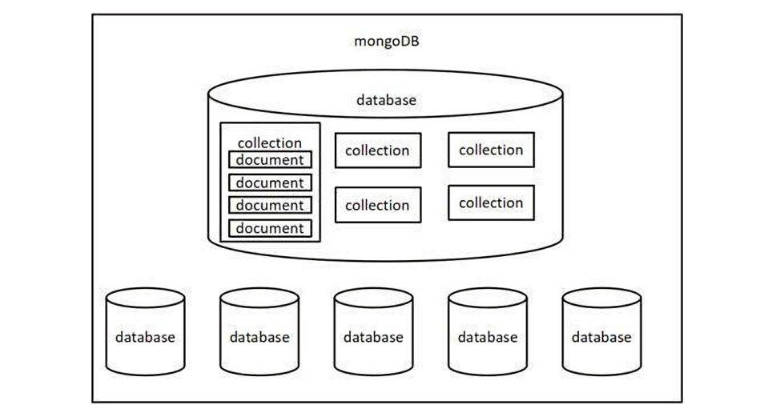
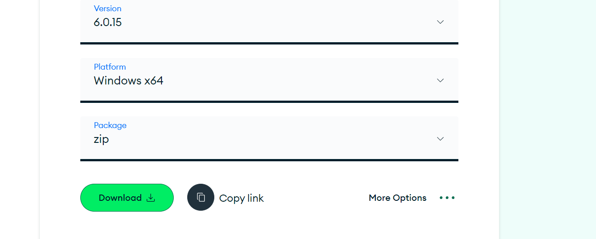
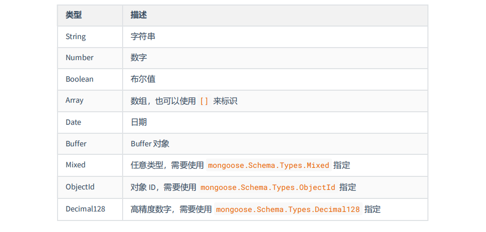
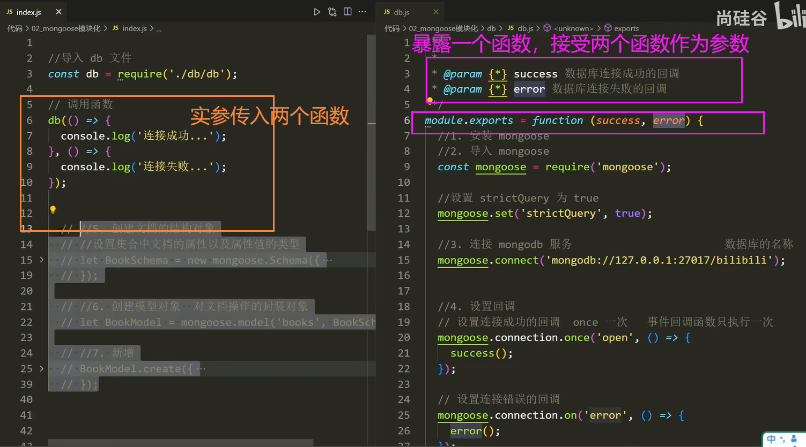
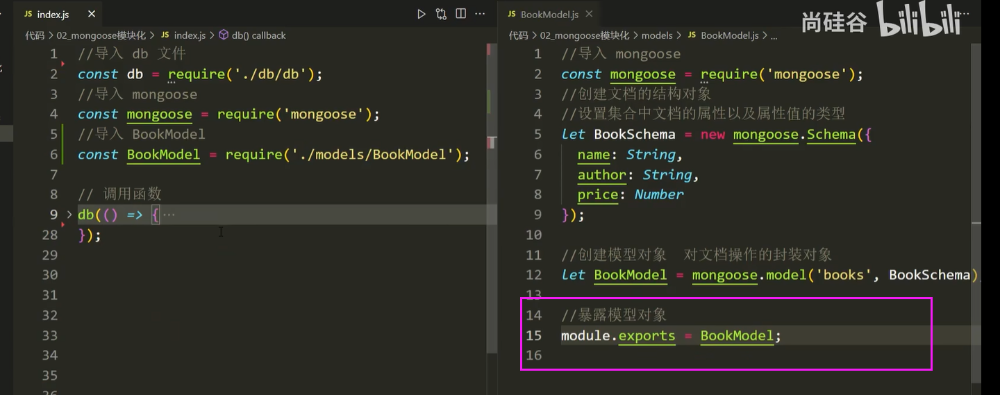

# MongoDB

MongoDB 是一个基于分布式文件存储的数据库，官方地址 **https://www.mongodb.com/**


数据库（DataBase）是按照数据结构来组织、存储和管理数据的 应用程序

数据库的主要作用就是 管理数据 ，对数据进行 增、删、改、查 CDUR

- **数据库管理数据的特点**

相比于纯文件管理数据，数据库管理数据有如下特点：

1. 速度更快
2. 扩展性更强
3. 安全性更强

- **为什么选择** **Mongodb**

操作语法与 JavaScript 类似，容易上手，学习成本低

## 核心概念

Mongodb 中有三个重要概念需要掌握

数据库（database） 数据库是一个数据仓库，数据库服务下可以创建很多数据库，数据库中可以存放很多集合

集合（collection） 集合类似于 JS 中的数组，在集合中可以存放很多文档

文档（document） 文档是数据库中的最小单位，类似于 JS 中的对象



- 大家可以通过 JSON 文件来理解 Mongodb 中的概念

一个 JSON 文件 好比是一个 数据库 ，一个 Mongodb 服务下可以有 N 个数据库

JSON 文件中的 一级属性的数组值 好比是 集合

数组中的对象好比是 文档

对象中的属性有时也称之为 字段

- 下面的JSON文件是一个数据库，数组accounts和users是集合，数组内的对象是文档

```json
{
  "accounts": [
    {
    "id": "3-YLju5f3",
    "title": "买电脑",
    "time": "2023-02-08",
    "type": "-1",
    "account": "5500",
    "remarks": "为了上网课"
    },
    {
    "id": "3-YLju5f4",
    "title": "请女朋友吃饭",
    "time": "2023-02-08",
    "type": "-1",
    "account": "214",
    "remarks": "情人节聚餐"
    },
    {
    "id": "mRQiD4s3K",
    "title": "发工资",
    "time": "2023-02-19",
    "type": "1",
    "account": "4396",
    "remarks": "终于发工资啦!~~"
    }
  ],
  "users":[
    {
    "id": 1,
    "name": "zhangsan",
        "age": 18
    },
    {
    "id": 2,
    "name": "lisi",
    "age": 20
    },
    {
    "id": 3,
    "name": "wangwu",
    "age": 22
    }
  ]
}
```

- 注意事项

一般情况：一个项目使用一个数据库；一个集合会存储同一种类型的数据


## 安装

>  C:\Program Files\mongodb-win32-x86_64-windows-6.0.15



5.0版本以上，需要在官网额外安装 mongo shell，然后用 mongosh连接

## 命令行交互

### 数据库命令

1. 显示所有的数据库 

     ``````
     show dbs
     ``````

2. 切换到指定的数据库，如果数据库不存在会自动创建数据库  

   ```
   use 数据库名

3. 显示当前所在的数据库  

   ``````
   db
   ``````

4. 删除当前数据库

   ```
   use 数据库名 
   db.dropDatabase()
   ```

### 集合命令

1. 创建集合

   ```
   db.createCollection('集合名称')
   ```

2. 显示当前数据库中的所有集合

   ```
   show collections
   ```

3. 删除某个集合

   ```
   db.集合名.drop()
   ```

4. 重命名集合

   ```
   db.集合名.renameCollection('newName')
   ```

### 文档命令

1. 插入文档

   ```
   db.集合名.insert(文档对象);
   ```

2. 查询文档

   ```
   db.集合名.find() //查询所有
   db.集合名.find(查询条件)
   ```

_id 是 mongodb 自动生成的唯一编号，用来唯一标识文档

3. 更新文档

   ```
   db.集合名.update(查询条件,新的文档)
   db.集合名.update({name:'张三'},{$set:{age:19}})
   ```

4. 删除文档

   ```
   db.集合名.remove(查询条件)
   ```

   

## 应用场景

**新增**

用户注册

发布视频

发布商品

发朋友圈

发评论

发微博

发弹幕

.......

**删除**

删除评论

删除商品

删除文章

删除视频

删除微博

......

**更新**

更新个人信息

修改商品价格

修改文章内容

......

**查询**

商品列表

视频列表

朋友圈列表

微博列表

搜索功能

......

# Mongoose

Mongoose 是一个对象文档模型库，官网 **http://www.mongoosejs.net/**

**作用**：方便使用代码操作 mongodb 数据库

## 基本使用

- 安装

```
npm i Mongoose 
```

- 导入

```
const mongoose = require('mongoose');
```

- 连接数据库，找不到这个数据库会新建一个

```
mongoose.connect('mongodb://127.0.0.1:27017/bilibili');
//协议名称+IP地址+mongodb默认端口号+数据库名称
```

- CMD命令行 mongo命令，打开mongo服务器
- 连接成功、连接失败、连接关闭的回调

```
mongoose.connection.on('open', () => {})
mongoose.connection.on('error', () => {})
mongoose.connection.on('close', () => {})
```

- 插入文档

```javascript
 //5. 创建文档结构对象
    //约束集合中文档的属性一级属性值的类型
  let BookSchema = new mongoose.Schema({
    title: String,
    author: String,
    price: Number
  });

  //6. 创建文档模型对象
    // book是集合名称 
  let BookModel = mongoose.model('book', BookSchema);

  //7. 插入文档
  BookModel.create({
    title: '西游记',
    author: '吴承恩',
    price: 19.9
  }).then(doc=>{
    //输出 data 对象
    console.log(doc);
    //8. 断开连接
    mongoose.disconnect();
  }).catch(err=>{
     throw err
  })
});


// BookModel.create({}).then(doc=>{}).catch(err=>{})
```


- 示例

```javascript
//1. 安装 mongoose
// npm i Mongoose 

//2. 导入 mongoose
const mongoose = require('mongoose');

//3. 连接数据库
mongoose.connect('mongodb://127.0.0.1:27017/bilibili');

//4. 设置连接回调
//连接成功
mongoose.connection.on('open', () => {
  console.log('连接成功');

  //5. 创建文档结构对象
    //约束集合中文档的属性一级属性值的类型
  let BookSchema = new mongoose.Schema({
    title: String,
    author: String,
    price: Number
  });

  //6. 创建文档模型对象
    // book是集合名称 
  let BookModel = mongoose.model('book', BookSchema);

  //7. 插入文档
  BookModel.create({
    title: '西游记',
    author: '吴承恩',
    price: 19.9
  }).then(doc=>{
    //输出 data 对象
    console.log(doc);
    //8. 断开连接
    mongoose.disconnect();
  }).catch(err=>{
     throw err
  })
});

//连接出错
mongoose.connection.on('error', () => {
  console.log('连接出错~~');
})

//连接关闭
mongoose.connection.on('close', () => {
  console.log('连接关闭');
})
```

## 字段类型



```javascript
let BookSchema = new mongoose.Schema({
  title: String,
  author: String,
  price: Number,
  is_hot: Boolean,
  tags: Array,
  pub_time: Date
});

//6. 创建文档模型对象
  // book是集合名称 
let BookModel = mongoose.model('book', BookSchema);

//7. 插入文档
BookModel.create({
  title: '西游记',
  author: '吴承恩',
  price: 19.9,
  is_hot: true,
  tags: ['悬疑','社会','励志'],
  pub_time: new Date()
}).then(doc=>{
  //输出 data 对象
  console.log(doc);
  //8. 断开连接
  mongoose.disconnect();
}).catch(err=>{
    throw err
})
```

### 字段值验证

> 在Schema中设置

**必填项**

```
title: {
	type: String,
	required: true // 设置必填项
}
```

**默认值**

```
author: {
	type: String,
	default: '匿名' //默认值
}
```

**枚举值**

````
gender: {
	type: String,
	enum: ['男','女'] //设置的值必须是数组中的
},
````

**唯一值**

```
username: {
    type: String,
	unique: true
},
```

##  CURD

数据库的基本操作包括四个，增加（create），删除（delete），修改（update），查（read）

### 增加

插入一条 ```BookModel.create({}).then(doc=>{}).catch(err=>{})```

插入多条 ```BookModel.insertMany({}).then(doc=>{}).catch(err=>{})```

- 示例

```javascript
const mongoose = require('mongoose');
mongoose.connect('mongodb://127.0.0.1:27017/bilibili');

//连接成功
mongoose.connection.once('open', () => {
  console.log('连接成功');

  let BookSchema = new mongoose.Schema({
    name: String,
    author: String,
    price: Number,
    is_hot: Boolean,
  });

  let BookModel = mongoose.model('book', BookSchema);

  //插入文档-插入一条
  BookModel.create({
    name: '西游记',
    author: '吴承恩',
    price: 19.9,
    is_hot: true,
  }).then(doc=>{
    console.log(doc);
    mongoose.disconnect();
  }).catch(err=>{
      throw err
  })

  //批量插入
  BookModel.insertMany([
    {
      name: '西游记',
      author: '吴承恩',
      price: 19.9,
      is_hot: true,
    },
    {
      name: '红楼梦',
      author: '曹雪芹',
      price: 20.1,
      is_hot: true,
    },
  ]).then(doc=>{
    console.log(doc);
    mongoose.disconnect();
  }).catch(err=>{
      throw err
  })
});

//连接出错
mongoose.connection.on('error', () => {
  console.log('连接出错~~');
})

//连接关闭
mongoose.connection.on('close', () => {
  console.log('连接关闭');
})
```

### 删除

删除一条数据 deleteOne

批量删除  deleteMany

```javascript
BookModel.deleteOne({_id:'6645ac91b649389db23b8113'}).then(doc=>{
  console.log(doc);
  console.log('删除成功');
  mongoose.disconnect();
}).catch(err=>{
  throw err
})

BookModel.deleteMany({is_hot:true}).then(doc=>{}).catch(err=>{})
```

### 修改

```javascript
//更新单个
BookModel.updateOne({条件},{新数据}}).then(doc=>{}).catch(err=>{})

//批量更新
BookModel.updateMany({条件},{新数据}}).then(doc=>{}).catch(err=>{})
```

### 查询

findOne、findById、find

```javascript
//查询一条数据
BookModel.findOne({条件}).then(doc=>{}).catch(err=>{})
// BookModell.findOne({{author: '王力宏'}).then(doc=>{}).catch(err=>{})

//根据 id 查询数据
BookModel.findById('5dd662b5381fc').then(doc=>{}).catch(err=>{})

//批量查询
//不加条件查询
BookModel.find().then(doc=>{}).catch(err=>{})
//加条件查询
BookModel.find({条件}).then(doc=>{}).catch(err=>{})
```

## 条件控制

### 运算符

在 mongodb 不能 > < >= <= !== 等运算符，需要使用替代符号


```
db.students.find({id:{$gt:3}}).then().catch id号比3大的所有的记录
```

### 逻辑运**算**

$or 逻辑或的情况

```
db.students.find({$or:[{age:18},{age:24}]});
//中括号内
```

$and 逻辑与的情况

```
db.students.find({$and: [{age: {$lt:20}}, {age: {$gt: 15}}]});
```

### 正则匹配

条件中可以直接使用 JS 的正则语法，通过正则可以进行模糊查询

```
书名中包含三的图书
BookModel.find({name: /三/}).then().catch()
```

## 个性化读取

### 字段筛选

```javascript
//0:不要的字段
//1:要的字段
SongModel.find().select({_id:0,title:1}).exec(function(err,data){
	if(err) throw err;
	console.log(data);
	mongoose.connection.close();
});
```

### 数据排序

```javascript
//sort 排序
//1:升序
//-1:倒序
SongModel.find().sort({hot:1}).exec(function(err,data){
	if(err) throw err;
	console.log(data);
	mongoose.connection.close();
});
```

### 数据截取

```javascript
//skip 跳过 limit 限定
// skip(10).limit(10)的意思是，跳过前十条，连续取10条
SongModel.find().skip(10).limit(10).exec(function(err,data){
	if(err) throw err;
	console.log(data);
	mongoose.connection.close();
});
```

# Mongoose模块化

- **拆分mongoose的操作(导入 连接)**

mongoose的 的导入、连接（成功 失败 关闭） 都是重复的代码，可以单独拎出一个模块。

暴露这个模块的时候，怎么保证代码是在连接成功的回调函数中执行？

解决方法：暴露出一个函数



- **拆分结构对象、模型对象**


