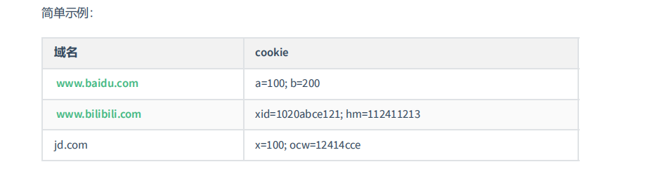
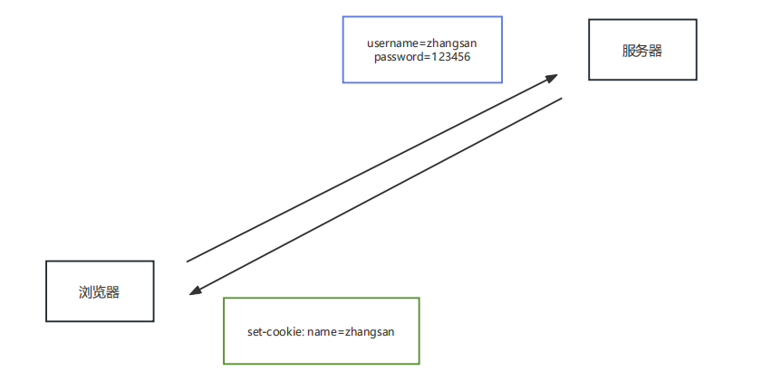
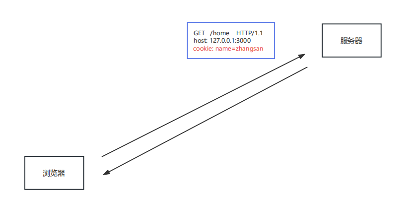
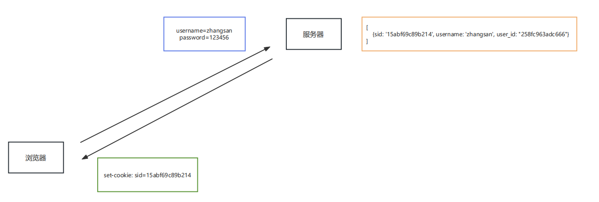
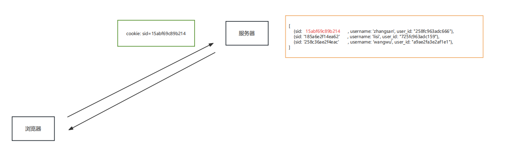
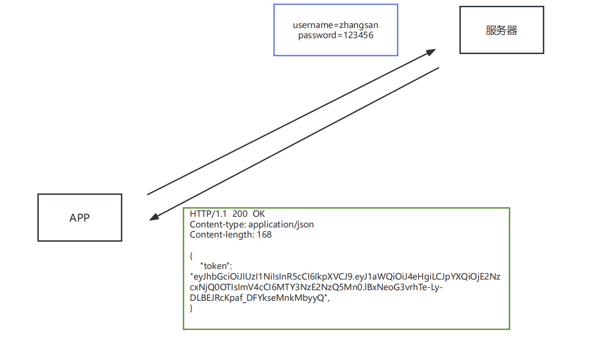
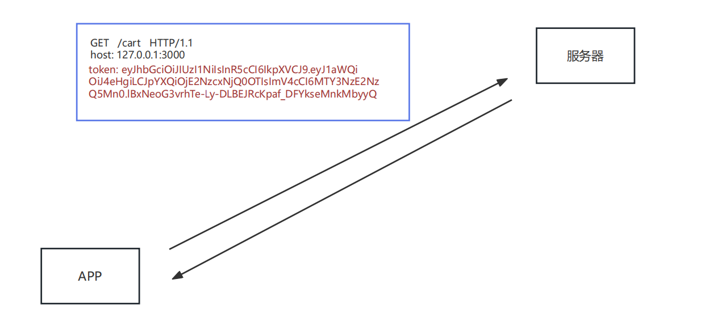

# 会话控制

## 介绍

所谓会话控制就是 对会话进行控制

HTTP 是一种无状态的协议，它没有办法区分多次的请求是否来自于同一个客户端， 也就是无法区分用户。而产品中又大量存在的这样的需求，所以我们需要通过 会话控制 来解决该问题。

- **常见的会话控制技术有三种：**

cookie、session、token

## cookie

**cookie 是 HTTP 服务器发送到用户浏览器并保存在本地的一小块数据**

解释：cookie 是保存在浏览器端的一小块数据，cookie 是按照域名划分保存的



### 特点

浏览器向服务器发送请求时，会自动将 当前域名下 可用的 cookie 设置在请求头中，然后传递给服务器

这个请求头的名字也叫 cookie ，所以将 cookie 理解为一个 HTTP 的请求头也是可以的

### 运行流程

<font color="red">浏览器第一次向服务器发送请求时，没有cookie，服务器返回数据时携带了cookie。此后在有效期内，浏览器给服务器发送请求都会携带cookie。</font>

填写账号和密码校验身份，校验通过后 下发 cookie



- 有了 cookie 之后，后续向服务器发送请求时，就会自动携带 cookie



**浏览器操作** **cookie**

浏览器操作 cookie 的操作，使用相对较少，大家了解即可

1. 禁用所有 cookie
2. 删除 cookie
3. 查看 cookie

### 代码操作(express)

express 中可以使用 cookie-parser 进行处理

```javascript
const express =require('express');
const app = express();

//1. 安装 cookie-parser npm i cookie-parser
//2. 引入 cookieParser 包
const cookieParser = require('cookie-parser');
//3. 设置 cookieParser 中间件
app.use(cookieParser());

//4-1 设置 cookie
app.get('/set-cookie', (request, response) => {
  // 不带时效性:关闭浏览器之后
  response.cookie('username','wangwu');
  // 带时效性
  response.cookie('email','12345678@qq.com', {maxAge: 60*1000 }); //max最大 age年龄，单位是毫秒 60*1000是一分钟
  //响应
  response.send('Cookie的设置');
});

//4-2 读取 cookie
app.get('/get-cookie', (request, response) => {
  //读取 cookie
  console.log(request.cookies);
  //响应体
  response.send('Cookie的读取');
});

//4-3 删除cookie
app.get('/delete-cookie', (request, response) => {
  //删除
  response.clearCookie('username');
  //响应
  response.send('cookie 的清除');
});


//4. 启动服务
app.listen(3000, () => {
  console.log('服务已经启动....');
});
```

## session

**session** **是什么**

session 是保存在 服务器端的一块儿数据 ，保存当前访问用户的相关信息

**session** **的作用**

实现会话控制，可以识别用户的身份，快速获取当前用户的相关信息

### 运行流程

填写账号和密码校验身份，校验通过后创建 session 信息（session对象） ，然后将 session_id 的值通过响应头返回给浏览器。

服务器把session_id**以响应cookie的形式给浏览器。**



有了 cookie，下次发送请求时会自动携带 cookie，服务器通过 cookie 中的 session_id 的值确定用户的身份



### 代码操作

express 中可以使用 express-session 对 session 进行操作。


- ```
  npm i express-session connect-mongo
  express-session默认把数据存入内存，不利于我们查看，所以我们借助connect-mongo包把数据存入mongo数据库

- 代码

```javascript
const express = require('express');
const app = express();

//1. 安装包 npm i express-session connect-mongo
//2. 引入 express-session connect-mongo
const session = require("express-session");
const MongoStore = require('connect-mongo');

//3. 设置 session 的中间件
// session是函数，接收对象
app.use(session({
  name: 'sid', //设置cookie的name，默认值是：connect.sid
  secret: 'atguigu', //参与加密的字符串（又称签名）加盐
  saveUninitialized: false, //是否为每次请求都设置一个cookie用来存储session的id
  resave: true, //是否在每次请求时重新保存session，因为session有生命周期
  store: MongoStore.create({
    mongoUrl: 'mongodb://127.0.0.1:27017/project' //数据库的连接配置
  }),
  cookie: {
    httpOnly: true, // 开启后，前端无法通过 JS 操作
    maxAge: 1000 * 60 * 5 // 这一条 是控制 sessionID 的过期时间的！！！
  }
}))

//创建 session
app.get('/login', (req, res) => {
  //设置session
  req.session.username = 'zhangsan';
  req.session.email = 'zhangsan@qq.com'
  res.send('登录成功');
})

//获取 session
app.get('/home', (req, res) => {
  console.log('session的信息');
  console.log(req.session.username);
  if (req.session.username) {
    res.send(`你好 ${req.session.username}`);
  }else{
   res.send('登录 注册');
  }
})

//销毁 session
app.get('/logout', (req, res) => {
  //销毁session
  // res.send('设置session');
  req.session.destroy(() => {
    res.send('成功退出');
  });
});

app.listen(3000, () => {
  console.log('服务已经启动, 端口 ' + 3000 + ' 监听中...')
});
```


## cookie & session

cookie 和 session 的区别主要有如下几点：

1. **存在的位置**

cookie：浏览器端

session：服务端

2. **安全性**

cookie 是以**明文**的方式存放在客户端的，安全性相对较低

session 存放于服务器中，所以安全性 **相对** 较好

3. **网络传输量**

cookie 设置内容过多会增大报文体积， 会影响传输效率

session 数据存储在服务器，只是通过 cookie 传递 id，所以不影响传输效率

4. **存储限制**

浏览器限制单个 cookie 保存的数据不能超过 4K ，且单个域名下的存储数量也有限制

session 数据存储在服务器中，所以没有这些限制

## token

**token** **是什么**

token 是服务端生成并返回给 HTTP 客户端的一串加密字符串， token 中保存着 用户信息

**token** **的作用**

实现会话控制，可以识别用户的身份，主要用于移动端 APP，网页端用session比较多

### 工作流程

填写账号和密码校验身份，校验通过后响应 token，token 一般是在响应体中返回给客户端的



后续发送请求时，需要手动将 token 添加在请求报文中，一般是放在请求头中



**区别cookie：cookie是自动携带的。token是手动的，需要手动放进请求报文**

### 特点

- 服务端压力更小

数据存储在客户端

- 相对更安全

数据加密

可以避免 CSRF（跨站请求伪造）

- 扩展性更强

服务间可以共享

增加服务节点更简单

### JWT

JWT（JSON Web Token ）是目前最流行的跨域认证解决方案，可用于基于 token 的身份验证

JWT 使 token 的生成与校验更规范

我们可以使用 jsonwebtoken 包 来操作 token

- ```npm i jsonwebtoken ```

- 代码

```javascript
//导入 jsonwebtokan
const jwt = require('jsonwebtoken');

//创建 token
// jwt.sign(数据, 加密字符串, 配置对象) 三个参数
let token = jwt.sign(
  { username: 'zhangsan'},  
  'atguigu', 
  {expiresIn: 60 }//单位是 秒
)

//解析 token
jwt.verify(token, 'atguigu', (err, data) => {
  if(err){
    console.log('校验失败~~');
    return
  }
  console.log(data);
})
```

